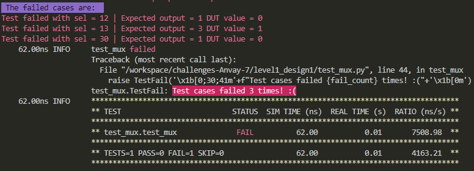

## Mux Design Verification 
 

 

## Verification Environment

The test drives inputs to the Design Under Test (mux module here) which takes in  31 2-bit inputs *(inp0-inp30)*, a 5-bit select line *(sel)* and gives out a 2-bit output *(out)*
The values are assigned to the input port using

    for i in range(31):
	    value = random.randint(0,3)
	    inputs[i] = value
	    code_line =  f"dut.inp{i}.value = {value}"
	    exec(code_line)

The assert statement in a try - except block is used to collect all the bugs (and not stop the test after a bug is found)

    try:
	    assert dut.out.value == inputs[sel_value]
    except  AssertionError  as e:
    	fail_count+=1
	    fail_msg='\33[31m'+f"Test failed with sel = {sel_value}"+'\x1b[0m'
	    failed_cases.append(fail_msg)
	    print("\t",fail_msg)
The following error is seen:
 

 
## Test Scenario

**Failed cases:**
Case 1
 - Test Inputs; sel = 12, inp12 = 1
- Expected Output: out = 1
 - Observed Output in the DUT: dut.out = 0

Case 2
 - Test Inputs; sel = 13, inp13 = 3
- Expected Output: out = 3
 - Observed Output in the DUT: dut.out = 1

Case 3
 - Test Inputs; sel = 30, inp30 = 1
- Expected Output: out = 1
 - Observed Output in the DUT: dut.out = 0

Output mismatches for the above three cases proving that there are design bugs.

## Design Bug
Based on the above test inputs and analysing the design, we see the following
**BUG1**

    5'b01101: out = inp12;   =====> BUG
    5'b01101: out = inp13;
    
The case condition should be `5'b01100 :  out = inp12` instead of  `5'b01101 :  out = inp12` as in the design code.
**BUG2**

    5'b11101: out = inp29;
     default: out = 0;
There is a case statement missing for sel = 5'b11110. Therefore `5'b11110: out =inp30` should be added after the case statement for sel = 5'b11101.

## Design Fix
Updating the mux design and re-running the test makes the test pass.
 

 
The updated design is checked as in `mux.v` in the folder `level1_design1_corrected`

## Verification Strategy
Here:
 - inp0-inp30 : They are assigned randomly generated integers in between 0 and 3
 - sel : It is looped from 0 to 31
The same inputs are stored in a dictionary with the select line value as the key. At the end the DUT value and dictionary value for the same select line value are compared to check for bugs.

## Is the verification complete?
The test is run multiple times. As the inputs are random in nature and we check for all the possible select line values in a single test, after running the test multiple times, we are able to capture all the possible bugs present in the design. Hence, we can say that the verification is complete!