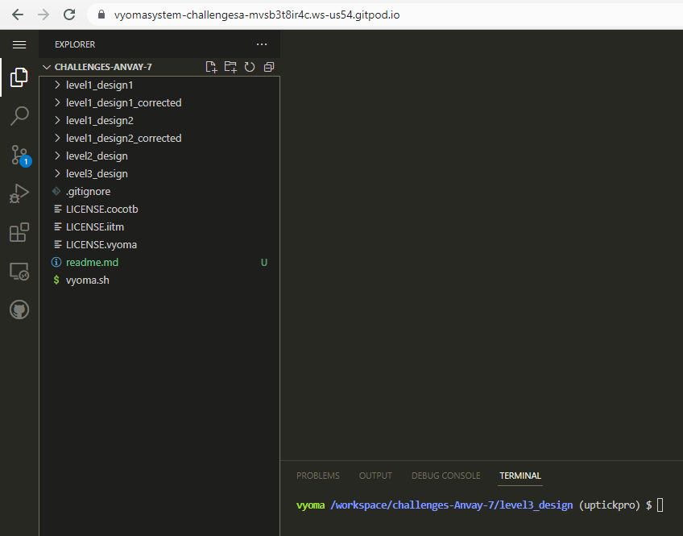
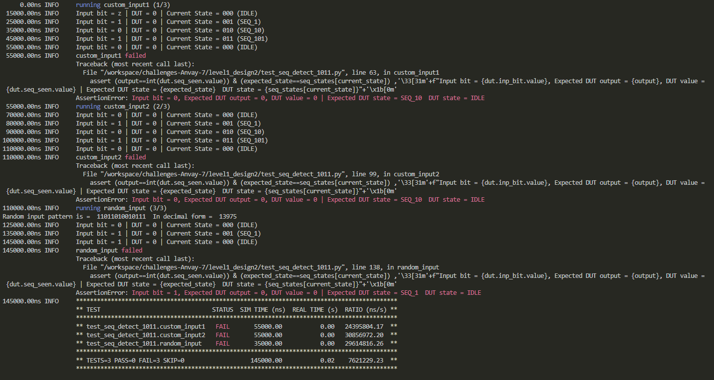
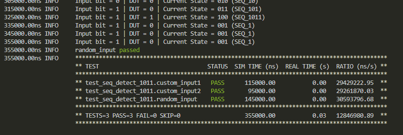

## Sequence Detector 1011 Design Verification 
 

 

## Verification Environment
The test drives inputs to the Design Under Test (sequence detector module here) which takes in an input bit *(inp_bit)*, a reset signal *(reset)*, a clock signal *(clk)* and gives an output *(seq_seen)*.
The values are assigned to the input port using

    input_pattern="1010111011"
    for bit in input_pattern:
	    dut.inp_bit.value =  int(bit)

The assert statement is used for comparing the sequence detectors ouput to the expected value.

 

    assert (output==int(dut.seq_seen.value)) & (expected_state==seq_states[current_state]) ,'\33[31m'+f"Expected DUT output = {output}, DUT value = {dut.seq_seen.value} | Expected DUT state = {expected_state} DUT state = {seq_states[current_state]}"+'\x1b[0m'

The following error is seen:
 

 
## Test Scenario

**Failed cases:**
Case 1
 - Test Input: inp_bit = 0
- Expected Output = 0
 - Observed Output in the DUT: dut.seq_seen = 0
 - Expected DUT state: SEQ_10
 - Observed DUT state: dut.current_state = IDLE

Case 2
 - Test Input: inp_bit = 1
- Expected Output = 0
 - Observed Output in the DUT: dut.seq_seen = 0
 - Expected DUT state: SEQ_1
 - Observed DUT state: dut.current_state = IDLE

Case 3
 - Test Inputs; sel = 30, inp30 = 1
- Expected Output: out = 1
 - Observed Output in the DUT: dut.out = 0

Output mismatches for the above three cases proving that there are design bugs.

## Design Bug
Based on the above test inputs and analysing the design, we see the following
**BUG1**

    SEQ_1:
      begin
        if(inp_bit == 1)
          next_state = IDLE;    ===>  BUG
        else
          next_state = SEQ_10;
      end
    
The next state should be changed from IDLE to SEQ_1 as 1 followed by a 1 gives way to same state SEQ_1
**BUG2**

    SEQ_101:
      begin
        if(inp_bit == 1)
          next_state = SEQ_1011;
        else
          next_state = IDLE;        ===> BUG
      end
The next state should be changed from IDLE to SEQ_10 as 101 followed by a 0 gives way to SEQ_10 state
**BUG3**

    SEQ_1011:
      begin
        next_state = IDLE;      ===> BUG
      end
The next state should be changed from IDLE for both 0 and 1 to SEQ_1 for 1011 followed by a 1

## Design Fix
Updating the seq_detector design and re-running the test makes the test pass.
 

 
The updated design is checked as in `seq_detect_1011.v` in the folder `level1_design2_corrected`

## Verification Strategy
The design is tested against both custom and random inputs. New bugs are discovered after fixing the old bugs. *(ex: BUG3 could only be discovered after the bugs 1 and 2 got fixed).* Therefore, the tests have to be run multiple times even after the test is passed few times as a new random sequnce might throw a new bug at us.
## Is the verification complete?
The test is run multiple times. Custom pattern is given to test the overlapping functionality and random pattern tests are also done, hence after running the test multiple times and fixing the design iteratively, we are able to capture all the possible bugs present in the design.