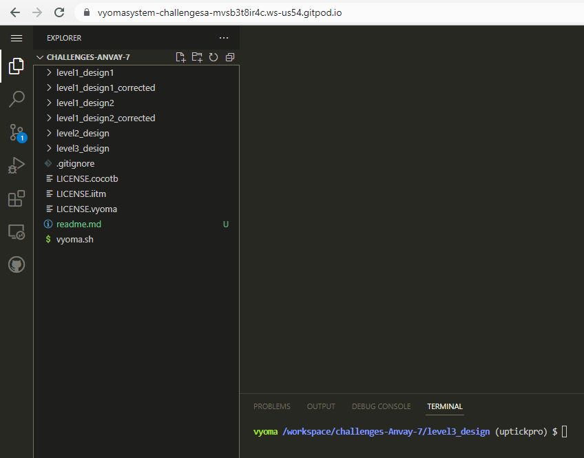
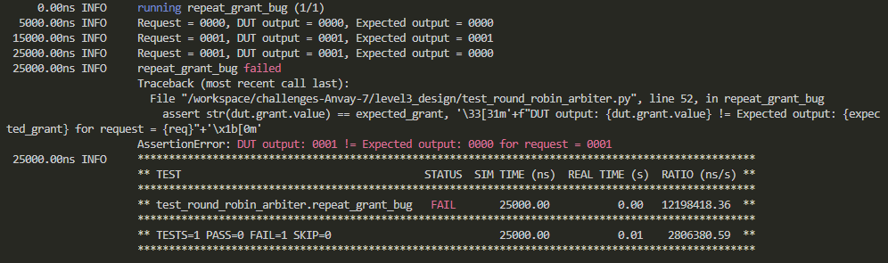
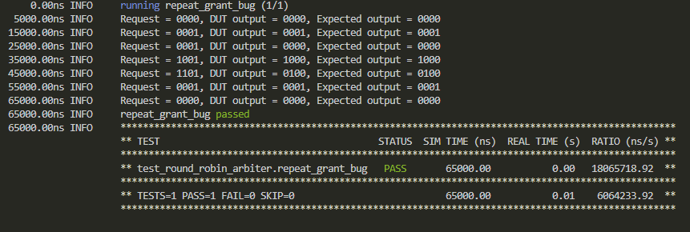

## Round Robin Arbiter Design Verification 
 

 

## Verification Environment
The test drives inputs to the Design Under Test (round robin arbiter module here) which takes in a reset signal *(rst_an)*, a clock signal *(clk)*, request bits *(req)* and gives grant bits *(grant)*.
The values are assigned to the input port using

    req_lst=["0000","0001","0001","1001","1101","0001","0000"]
    for req in req_lst:
	    dut.req.value = int(req,2)

The assert statement is used for comparing the sequence detectors ouput to the expected value.

 

    assert  str(dut.grant.value) == expected_grant, '\33[31m'+f"DUT output: {dut.grant.value} != Expected output: {expected_grant} for request = {req}"+'\x1b[0m'
The following error is seen:
 

 
## Test Scenario

**Failed case:**
 - Test Input: req = 0001
- Expected Output = 0000
 - Observed Output in the DUT: dut.seq_seen = 0001
Output mismatches for the above  cases proving that there are design bugs.

## Design Bug inserted
In round robin arbiter, the same device can't be granted access in continuous clock cycle. Hence, the logic to take care of that is removed from the original design.
**BUG**

    always @ (posedge clk or negedge rst_an)
    begin
    	if (!rst_an)	grant[3:0] <= 4'b0;
    	else		grant[3:0] <= grant_comb[3:0]; // BUG inserted here.
    end
    
`grant_comb[3:0]` should have been ANDed with `~grant[3:0]`

## Design Fix
Running the test on the original design makes the test pass.
The original design is checked as in `round_robin_arbiter.v` and the buggy design is checked in as  `round_robin_arbiter_buggy.v` in the folder `level1_design2_corrected`

## Verification Strategy
The design is tested against the custom request pattern which makes the repeated grant bug happen. 
 

 
## Is the verification complete?
The test is done just for the case to capture the repeated grant bug. Hence, the verification can't be said to be complete.